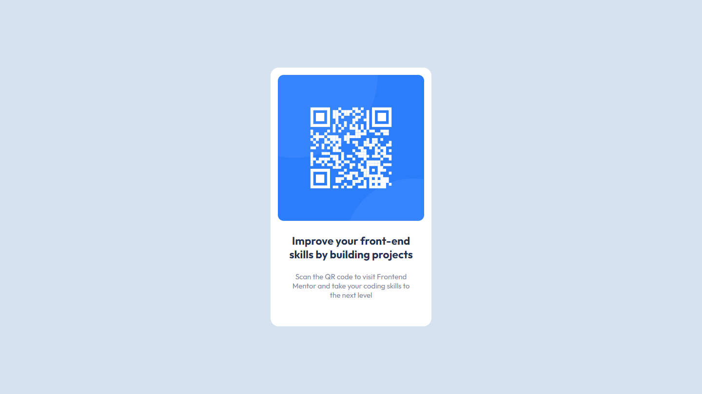

# Frontend Mentor - QR code component solution

This is a solution to the [QR code component challenge on Frontend Mentor](https://www.frontendmentor.io/challenges/qr-code-component-iux_sIO_H). Frontend Mentor challenges help you improve your coding skills by building realistic projects. 

## Table of contents

- [Overview](#overview)
  - [Screenshot](#screenshot)
  - [Links](#links)
- [My process](#my-process)
  - [Built with](#built-with)
  - [What I learned](#what-i-learned)
  - [Continued development](#continued-development)
  - [Useful resources](#useful-resources)
- [Author](#author)

## Overview

### Screenshot




### Links

- Solution URL: [Add solution URL here](https://your-solution-url.com)
- Live Site URL: [Add live site URL here](https://your-live-site-url.com)

## My process

### Built with

- Semantic HTML5 markup
- CSS custom properties
- CSS Grid


### What I learned

I learn how to center div.

```css
#center{
  display:grid;
  place-items: center;
  height:100%;
  width:100%;
}
```

### Continued development

I need to learn how css actually works instead of abusing flexbox.
I have no clue how the auto properties work.


### Useful resources

- [stackoverflow](https://stackoverflow.com)

## Author
- Frontend Mentor - [@mrskyeA](https://www.frontendmentor.io/profile/mrskyeA)


